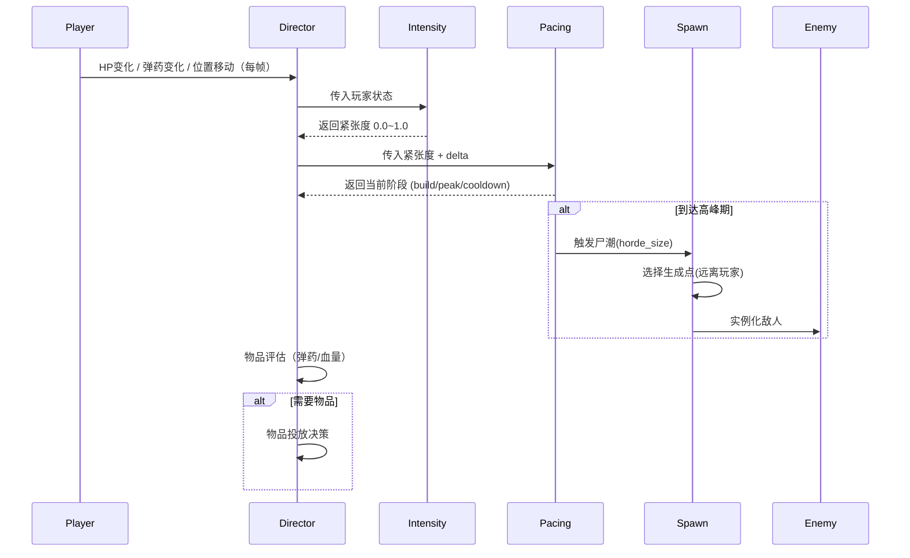

# 导演系统（Director System）设计方案

> **のび太的求生之路** — L4D2 AI Director 的 2D 俯视角实现
> 设计日期：2026-08-02
> 状态：**构思阶段，待实现**

---

## 目录

1. [概述](#1-概述)
2. [核心架构](#2-核心架构)
3. [紧张度系统（Intensity）](#3-紧张度系统)
4. [节奏控制器（Pacing）](#4-节奏控制器)
5. [敌人生成系统（Spawn）](#5-敌人生成系统)
6. [物品投放系统（Item Distribution）](#6-物品投放系统)
7. [事件系统（Events）](#7-事件系统)
8. [地图集成（Map Integration）](#8-地图集成)
9. [与现有系统的对接](#9-与现有系统的对接)
10. [实施分阶段计划](#10-实施分阶段计划)

---

## 1. 概述

### 1.1 设计目标

导演 AI 的核心不是"让游戏变难"，而是**"让游戏保持有趣"**——创造恰到好处的紧张感和节奏变化，使每一局体验都不同。

### 1.2 L4D2 → 2D 俯视角的适配

| L4D2 原版 | 本项目 |
|-----------|--------|
| 4 人合作 | 单人（后续 + AI 队友） |
| FPS 第一人称 | 俯视角 2D |
| 3D 空间声源定位 | 屏幕边缘提示 / 2D 音效 |
| 导演追踪 4 个玩家 | 追踪 1 个玩家 |
| 尸潮从视野外涌来 | 尸潮从屏幕外 / 预设刷怪点涌来 |
| 特殊感染者有立体行为 | 2D 化行为（见敌人系统设计） |

### 1.3 术语定义

| 术语 | 含义 |
|------|------|
| **紧张度（Intensity）** | 0.0–1.0 的浮点值，衡量玩家当前承受的压力 |
| **节奏（Pacing）** | 战斗高峰 ↔ 喘息低谷的循环 |
| **尸潮（Horde）** | 大量普通感染者同时涌向玩家 |
| **波次（Wave）** | 一次尸潮由 1~N 个波次组成 |
| **剧本事件（Scripted Event）** | 关卡固定位置触发的战斗（开门、警报等） |
| **生成点（Spawn Point）** | 地图上预定义的敌人生成位置 |
| **生成区（Spawn Zone）** | 一个矩形区域，敌人从此区域内的随机位置出现 |

---

## 2. 核心架构

### 2.1 Director 作为 Autoload

```
script/director/
├── director.gd              ← Autoload 单例（总控）
├── intensity_tracker.gd     ← 紧张度计算
├── pacing_controller.gd     ← 节奏管理
├── spawn_manager.gd         ← 敌人生成调度
├── item_manager.gd          ← 物品投放
├── event_manager.gd         ← 事件编排
├── spawn_point.gd           ← 地图生成点节点 (class_name)
└── spawn_zone.gd            ← 地图生成区节点 (class_name)
```

### 2.2 数据流



### 2.3 信号（Signals）

```gdscript
# director.gd 暴露的信号
signal intensity_changed(value: float)         # 紧张度变化（用于音乐/UI）
signal pacing_phase_changed(phase: String)     # 节奏阶段切换
signal horde_incoming()                        # 尸潮即将来临（UI 提示）
signal horde_started()                         # 尸潮开始
signal horde_ended()                           # 尸潮结束
signal special_spawned(type: String)           # 特殊感染者出现
signal item_spawn_requested(zone: Vector2)     # 请求生成物品
signal scripted_event_triggered(event: String) # 剧本事件触发
```

---

## 3. 紧张度系统

### 3.1 计算公式

```
intensity = clamp(
    hp_factor      * 0.30 +
    ammo_factor    * 0.20 +
    proximity_factor * 0.15 +
    progress_factor  * 0.15 +
    combat_factor    * 0.20,
    0.0, 1.0
)
```

### 3.2 各因子详解

#### HP 因子（权重 30%）
```
hp_ratio = current_hp / max_hp
hp_factor = (1.0 - hp_ratio)²    # 低血量时急剧升高
```

| HP% | hp_factor |
|-----|-----------|
| 100% | 0.00 |
| 75% | 0.06 |
| 50% | 0.25 |
| 25% | 0.56 |
| 10% | 0.81 |
| 1% | 0.98 |

#### 弹药因子（权重 20%）
```
# 取主武器 + 副武器的平均弹药比例
ammo_ratio = (primary_ammo_pct + secondary_ammo_pct) / 2
ammo_factor = 1.0 - ammo_ratio    # 弹药越少越紧张
```

| 弹药% | ammo_factor |
|-------|-------------|
| 100% | 0.00 |
| 50% | 0.50 |
| 0% | 1.00 |

#### 敌人接近度因子（权重 15%）
```
# 取最近 N 个敌人的平均距离
avg_dist = 最近 5 个敌人的平均距离（像素）
proximity_factor = clamp(1.0 - avg_dist / SAFE_RADIUS, 0.0, 1.0)
# SAFE_RADIUS = 300px（约 10 格）
```

#### 关卡进度因子（权重 15%）
```
# 越接近关卡终点越紧张
progress_factor = current_progress  # 0.0（起点）→ 1.0（终点）
```

#### 战斗状态因子（权重 20%）
```
combat_factor = in_combat ? 0.8 : 0.2
# 处于战斗中：直接 0.8
# 脱战：0.2 作为基调
```

### 3.3 平滑处理

```gdscript
# 使用 lerp 平滑变化，避免突变
var smooth_intensity := lerp(_current_intensity, _raw_intensity, delta * 2.0)
```

---

## 4. 节奏控制器

### 4.1 三阶段循环

```
      Build-up         Peak           Cooldown
    (45~90秒)      (30~60秒)        (30~60秒)
   ─────────────→ ───────────→ ─────────────→
   压力逐步升高      尸潮/战斗         玩家喘息
   少量散兵骚扰    大量敌人涌来      敌人生成暂停
   准备投放物品    特效/Boss出场     可用的物品补给
```

### 4.2 阶段参数

| 参数 | Build-up | Peak | Cooldown |
|------|----------|------|----------|
| 敌人生成 | 少量散兵（1-3 个/次） | 尸潮（10-30 个） | 零散（0-1 个） |
| 生成间隔 | 15-30 秒 | 连续出怪 | 不主动生成 |
| 特殊感染者 | 可生成 1 个 | 生成 1-2 个 | 不生成 |
| 物品投放 | 正常 | 暂停 | 投放补给 |
| 音乐提示 | 紧张感渐强 | 战斗音乐 | 安静/放松 |

### 4.3 阶段切换条件

```
Cooldown → Build-up:
    cooldown 经过 30~60 秒
    或者 紧张度 > 0.3（玩家自己触发了战斗）

Build-up → Peak:
    build-up 经过 45~90 秒
    或者 紧张度 > 0.7（提前进入高峰）
    或者 玩家触发了剧本事件

Peak → Cooldown:
    所有生成的敌人被消灭
    或者 尸潮最大持续时间（60 秒）到达
    或者 玩家进入安全门
```

### 4.4 随机变化

每次循环的时长有一定随机偏移（±20%），保证节奏不完全相同：
```gdscript
var build_duration := randf_range(36.0, 108.0)   # 45-90s ±20%
var peak_timeout   := randf_range(48.0, 72.0)     # 60s ±20%
var cooldown_min   := randf_range(24.0, 72.0)     # 30-60s ±20%
```

---

## 5. 敌人生成系统

### 5.1 普通感染者（Common Infected）

#### 生成规模

| 紧张度 | 生成数量 | 间隔 |
|--------|---------|------|
| < 0.2 | 0 | — |
| 0.2–0.4 | 1–3 | 每 15–30s |
| 0.4–0.7 | 3–8 | 每 8–15s |
| 0.7–1.0 (尸潮) | 10–30 | 连续（分批出） |

#### 尸潮（Horde）生成

尸潮不是一次性刷出所有敌人，而是**分批生成**：

```
尸潮总量：10~30 个（由紧张度决定）
每批数量：3~6 个
批次间隔：2~5 秒
同一时间最大活跃数：15 个
```

```
时间轴：
t=0s   第一批(4个)生成
t=3s   第二批(5个)生成
t=6s   第三批(3个)生成
t=9s   第四批(5个)生成  ← 第一批可能已被击杀
...
        直到总数达到 horde_total 或者 peak 结束
```

### 5.2 生成点选择规则

```
优先级：
1. 玩家视野外（距离 > 400px，约 ~13 格）
2. 路径可达（A* 能走到玩家位置）← 避免生成在封闭区域
3. 不在其他敌人 64px 范围内（避免堆叠）
4. 优先在玩家后方 / 侧方生成（不是正前方）
```

不能生成的位置：
- 玩家的 HurtArea 范围内
- UpperLayer / Wall 层 tile 上
- DecorLayer 有碰撞的 tile 上
- 已存在敌人的位置

### 5.3 特殊感染者生成

#### 生成规则

| 特殊感染者 | 同时最多 | 冷却时间 | 触发条件 |
|-----------|---------|---------|---------|
| Hunter | 1 | 60–120s | 紧张度 > 0.4 |
| Smoker | 1 | 60–120s | 紧张度 > 0.3 |
| Boomer | 1 | 90–150s | 紧张度 > 0.3 |
| Spitter | 1 | 90–150s | 紧张度 > 0.5 |
| Jockey | 1 | 60–120s | 紧张度 > 0.6 |
| Charger | 1 | 90–150s | 紧张度 > 0.6 |
| Tank | 1 | 180–300s | 进度 60–80% 或紧张度 > 0.85 |
| Witch | 1 | 120–180s | 随机放置，不主动攻击 |

#### 生成上限

```
同时存在的特殊感染者 ≤ 2（进度 < 50%）
同时存在的特殊感染者 ≤ 3（进度 ≥ 50%）
Tank 不计入上限
```

### 5.4 生成执行流程

```
1. SpawnManager 收到生成请求（数量、类型）
2. 查询地图上所有 SpawnPoint / SpawnZone
3. 过滤：排除玩家视野内、不可达、已被占用的点
4. 按优先级排序（距离玩家远优先、后方优先）
5. 取前 N 个点
6. 加载 enemy.tscn → 设置位置 → add_child 到 DecorLayer
7. 发送生成信号（用于 UI 提示）
```

### 5.5 敌人生成后行为

生成的敌人初始状态：
- 普通感染者：默认 `"Idle"` 状态，VisionArea 已激活
- 特殊感染者：各自特定行为

**新生敌人寻路**：生成的敌人如果在 Build-up 阶段（非尸潮），先随机巡逻（后续迭代），否则直接追击玩家。

---

## 6. 物品投放系统

### 6.1 投放时机

| 条件 | 投放内容 | 概率 |
|------|---------|------|
| HP < 50% 且无治疗品 | 急救喷雾 | 60% |
| HP < 30% | 药品 | 40% |
| 弹药 < 30% | 弹药堆 | 70% |
| 无副武器（刚复活/丢失） | Tier 1 副武器 | 80% |
| 刚完成一波尸潮 | 混合补给 | 80% |
| 接近安全门（< 100px） | 不做投放 | — |

### 6.2 投放位置

- 在玩家前方路径上（前进方向 200–400px）
- 不能放在不可达位置（墙里）
- 不能放在敌人 128px 范围内
- 优先放在明显的通道/路口

### 6.3 武器 Tier 投放

| 关卡进度 | 可投放武器 |
|---------|-----------|
| 0–30% | Tier 1（手枪、小刀） |
| 30–70% | Tier 1 + 冲锋枪、霰弹枪（铬） |
| 70–100% | Tier 2（步枪、战术霰弹） |
| 特殊 | 稀有武器（概率 5%） |

### 6.4 降级投放（Fail-Safe）

当玩家表现极差时（HP < 20% 超过 30 秒、倒地过），触发降级投放：
- 额外急救喷雾 × 1
- 弹药堆 × 1
- 投掷品 × 1

冷却：180 秒内最多触发一次。

---

## 7. 事件系统

### 7.1 事件类型

| 类型 | 触发方式 | 示例 |
|------|---------|------|
| **自然事件** | 导演根据节奏触发 | 尸潮、特殊感染者 |
| **剧本事件** | 关卡固定位置触发 | 开门警报、电梯防守 |
| **反应事件** | 玩家行为触发 | Boomer 胆汁 → 尸潮 |
| **Boss 事件** | 进度 + 紧张度 | Tank 出场 |

### 7.2 剧本事件

地图中放置 `EventTrigger` 节点：

```
ScriptedEvent (Node)
├── trigger_type: enum (CRESCENDO / FINALE / ALARM / BOSS)
├── event_duration: float（防守时长，秒）
├── spawn_profile: Resource（定义生成什么敌人、数量）
├── trigger_rect: Rect2（玩家进入此区域触发）
├── one_shot: bool（是否只触发一次）
└── on_complete: signal（防守完成）
```

#### Crescendo（长防守事件）

例如 L4D2 的"开门"、"等电梯"：
1. 玩家触发事件
2. 游戏提示"防守直到警报停止"
3. 导演切换到 PEAK 模式
4. 连续生成敌人，持续 `event_duration` 秒
5. 时间到 → 剩余敌人自动死亡或逃跑
6. 事件完成，玩家继续前进

### 7.3 Tank 事件

```
触发条件：
  1. 关卡进度 60–80%（固定出现一次）
  2. 紧张度 > 0.85 持续 15 秒（额外出现）
  3. 最终章会自动触发 1 次

Tank 出场流程：
  1. 音乐切换为 Tank 主题
  2. HUD 显示 Boss 血条
  3. Tank 从玩家前方生成（冲撞进场）
  4. Tank 随时间自动扣血（愤怒机制）
  5. 击杀后恢复正常节奏
```

### 7.4 Witch 放置

- 每个关卡 1-3 个 Witch
- 放置在路径沿途的固定位置
- 随机偏移 ±50px（不完全相同位置）
- 放置条件：不在玩家视野内，路径可达

---

## 8. 地图集成

### 8.1 SpawnPoint 节点

```gdscript
class_name SpawnPoint extends Node2D
## 放置在关卡场景中，标记敌人生成位置

@export var point_type: SpawnType = SpawnType.COMMON  # COMMON / SPECIAL / BOTH
@export var facing: int = 0          # 生成后的初始朝向（0=下,1=左,2=右,3=上）
@export var priority: float = 1.0    # 权重（1.0=标准，>1 优先使用，<1 降低使用）
@export var enabled: bool = true     # 是否启用（剧本事件可动态开关）

enum SpawnType { COMMON, SPECIAL, BOTH }
```

放置在关卡场景中：
```
scene/maps/突袭-第一关-街道.tscn
├── GroundLayer (TileMapLayer)
├── DecorLayer (TileMapLayer)         ← 玩家/敌人父节点
├── UpperLayer (TileMapLayer)
├── SpawnPoint (0,0)                   ← 敌人刷新点
├── SpawnPoint (0,1)
├── SpawnPoint (0,2)
├── ...
├── Player (CharacterBody2D)
└── Camera2D
```

### 8.2 SpawnZone 节点

```gdscript
class_name SpawnZone extends Node2D
## 一个矩形生成区域，敌人从此区域内的随机位置出现

@export var zone_size: Vector2 = Vector2(128, 128)  # 区域尺寸
@export var zone_type: SpawnType = SpawnType.COMMON
@export var max_spawns: int = 5        # 同时最多生成数
@export var enabled: bool = true

func get_random_position() -> Vector2:
    var hw := zone_size.x / 2.0
    var hh := zone_size.y / 2.0
    return global_position + Vector2(
        randf_range(-hw, hw),
        randf_range(-hh, hh)
    )
```

### 8.3 EventTrigger 节点

```gdscript
class_name ScriptedEventTrigger extends Area2D
## 放置在关卡场景中，玩家进入时触发剧本事件

@export var event_name: String = ""           # 事件标识符
@export var event_type: EventType = EventType.CRESCENDO
@export var event_duration: float = 60.0      # 防守时长
@export var one_shot: bool = true             # 是否只触发一次

enum EventType { CRESCENDO, FINALE, ALARM, BOSS, HORDE }
```

---

## 9. 与现有系统的对接

### 9.1 需要读取的数据

| 数据来源 | 字段 | 用途 |
|---------|------|------|
| `player.gd` | `current_hp`, `max_hp` | HP 因子 |
| `player.gd` | `current_character.hp` | 角色基准 HP |
| `Global` | `equipment.primary/secondary` → WeaponData | 弹药计数 |
| `Global` | `count_ammo_item(ammo_item_id)` | 备弹量 |
| `Global` | `healing_item`, `support_item` | 背包物品 |
| `player.gd` | `global_position` | 进度计算、位置追踪 |
| 场景 | `get_progress_ratio()` | 当前关卡进度 |

### 9.2 需要调用的系统

| 系统 | 调用 | 说明 |
|------|------|------|
| 敌人场景 | `enemy.tscn.instantiate()` | 生成敌人 |
| 武器拾取物 | `WeaponPickup.spawn()` | 生成武器 |
| 物品拾取物 | `ItemPickup.spawn()` | 生成治疗品 |
| 音效 | `Global.play_sfx_managed()` | 尸潮提示音 |
| 音乐 | `AudioServer` / `Global` | 动态音乐切换 |
| HUD | `hud.gd` | Boss 血条、尸潮提示 |

### 9.3 现有场景结构约束

```
# 当前关卡场景标准结构（见 CLAUDE.md）
GroundLayer    ← 地面图块（A* 查此层判断可行走）
DecorLayer     ← 玩家/敌人必须是此层的子节点（y_sort）
UpperLayer     ← 上层装饰（A* 忽略）
```

**敌人生成时**：`enemy_instance` 必须 `add_child` 到 **DecorLayer** 下。

---

## 10. 实施分阶段计划

### Phase 1：基础框架（MVP）

| 任务 | 产出 | 依赖 |
|------|------|------|
| `director.gd` autoload 骨架 | 单例注册 + 信号定义 | — |
| `intensity_tracker.gd` | HP/弹药因子 + 紧张度计算 | player.gd 暴露 HP |
| `spawn_point.gd` 节点 | class_name + @export | — |
| 地图上放几个 SpawnPoint | 测试用生成点 | 关卡场景 |
| 手动按键触发生成 | F5 生成 5 个普通感染者 | enemy.tscn |
| 敌人从生成点出现 + 自动追击 | 验证寻路 | EnemyChaseState |

**目标**：按一个键能在地图上刷出敌人，敌人能跑到玩家面前。

### Phase 2：节奏 + 尸潮

| 任务 | 产出 | 依赖 |
|------|------|------|
| `pacing_controller.gd` | 三阶段循环 | intensity_tracker |
| `spawn_manager.gd` | 自动定时生成散兵 | spawn_point |
| 尸潮分批生成 | 连续出怪 + 上限控制 | spawn_manager |
| `event_manager.gd` | 自然尸潮触发 | pacing |
| 尸潮提示 UI | 屏幕文字 / 音效 | HUD |

**目标**：游戏自动有节奏地出怪，有高峰和喘息。

### Phase 3：物品 + 剧本

| 任务 | 产出 | 依赖 |
|------|------|------|
| `item_manager.gd` | 物品投放决策 + 生成 | Global 物品系统 |
| `event_trigger.gd` | 剧本事件节点 | event_manager |
| Crescendo 防守事件 | 固定时长刷怪 | event_trigger |
| 安全门机制 | 进安全门 = 回血 + 结束当前循环 | 关卡结构 |

### Phase 4：特殊感染者 + Boss

| 任务 | 产出 | 依赖 |
|------|------|------|
| Hunter / Smoker / Boomer 生成 | 特殊生成逻辑 | spawn_manager |
| Tank 事件 | Boss 血条 + 音乐 + 生成 | event_manager |
| Witch 放置 | 关卡初始化时随机放置 | spawn_manager |
| 动态音乐 | 根据紧张度切换 BGM | intensity_tracker |

### Phase 5：深度打磨

| 任务 | 产出 | 依赖 |
|------|------|------|
| 动态难度自适应 | 根据玩家表现调参 | 全部 |
| 降级投放（Fail-Safe） | 玩家极差时额外补给 | item_manager |
| 导演调试面板 | 实时看紧张度曲线/阶段/生成日志 | Debug UI |
| 性能优化 | 敌人 LOD / 尸体清理策略 | — |

---

## 附录 A：导演参数速查表

| 参数 | 默认值 | 说明 |
|------|--------|------|
| `INTENSITY_SMOOTH_SPEED` | 2.0 | 紧张度平滑过渡速度 |
| `SAFE_RADIUS` | 300 | 敌人接近度的安全半径（px） |
| `BUILD_MIN_DURATION` | 36s | 节奏 build 阶段最短 |
| `BUILD_MAX_DURATION` | 108s | 节奏 build 阶段最长 |
| `PEAK_TIMEOUT` | 60s | 高峰阶段最大时长 |
| `COOLDOWN_MIN` | 24s | 喘息阶段最短 |
| `COOLDOWN_MAX` | 72s | 喘息阶段最长 |
| `HORDE_BATCH_SIZE` | 4 | 尸潮每批生成数量 |
| `HORDE_BATCH_INTERVAL` | 3s | 尸潮批次间隔 |
| `MAX_ACTIVE_COMMON` | 15 | 同时最多普通感染者 |
| `MAX_ACTIVE_SPECIAL` | 3 | 同时最多特殊感染者 |
| `SPAWN_MIN_DIST` | 400 | 生成点距玩家最小距离（px） |
| `ITEM_CHECK_INTERVAL` | 10s | 物品投放检查间隔 |
| `FAILSAFE_COOLDOWN` | 180s | 降级投放冷却 |
| `TANK_PROGRESS_RANGE` | 0.6–0.8 | Tank 出场关卡进度区间 |
| `WITCHES_PER_MAP` | 2 | 每关 Witch 数量 |

## 附录 B：信号连接示例

```gdscript
# 在 game_init.gd 或关卡脚本中：

func _ready():
    var d := Director  # autoload
    
    # 紧张度变化 → HUD 更新
    d.intensity_changed.connect(_on_intensity_changed)
    
    # 尸潮提示
    d.horde_incoming.connect(_on_horde_incoming)
    
    # 节奏阶段切换
    d.pacing_phase_changed.connect(_on_phase_changed)
    
    # 特殊感染者
    d.special_spawned.connect(_on_special_spawned)

func _on_intensity_changed(value: float):
    # 屏幕边缘血框效果、音乐过渡等
    pass

func _on_horde_incoming():
    # 播放尸潮提示音 + 屏幕闪烁文字
    Global.play_sfx_managed(horde_warning_sound)
    hud.show_horde_warning("尸潮来袭！")

func _on_phase_changed(phase: String):
    match phase:
        "build":     music_player.crossfade_to(build_music)
        "peak":      music_player.crossfade_to(combat_music)
        "cooldown":  music_player.crossfade_to(calm_music)
```
